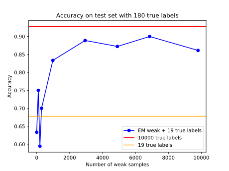

# RecyclingLabels

[](https://travis-ci.com/perellonieto/RecyclingLabels)

Code that shows how to reuse old labels that are known to contain errors (weak
labels) by adding knowledge about how a sub-sample of this labels has evolved
over time by the acquisition of new true labels

### Unittest

**Currently not working, need to address problems**

```bash
./runtests.sh
```

### Installation

```bash
git clone git@github.com:perellonieto/RecyclingLabels.git
cd RecyclingLabels
virtualenv --system-site-packages -p python3 venv
. venv/bin/activate
pip install -U pip
pip install -r requirements3.txt
```

### Test with EM experiment

```bash
python compare_full_vs_EM.py
```

Will generate a plot in the same directory called __full_vs_EM.svg__



### Example of running

```bash
python run_baseline.py --dataset webs --seed 0 --method EM --architecture lr \
    --path-results results_test_1 --processes 1 --iterations 2 --k-folds 2 \
    --epochs 10 --file-M M_64_x_6_uniform.csv --prop-weak 1.0 --prop-clean 1.0
```

It is possible to see the usage by calling with the --help argument

```bash
pthon run_baseline.py --help
usage: run_baseline.py [-h] [-a ARCHITECTURE] [-c EPOCHS] [-d DATASET] [-e]
                       [-f PROP_WEAK] [-g PROP_CLEAN] [-i N_ITERATIONS]
                       [-k K_FOLDS] [-l LOSS] [-M FILE_M] [-m METHOD] [-o]
                       [-p N_JOBS] [-r PATH] [-s SEED] [-t PATH_MODEL]
                       [-v VERBOSE]

Runs a test with a toy example or a real dataset

optional arguments:
  -h, --help            show this help message and exit
  -a ARCHITECTURE, --architecture ARCHITECTURE
                        Model architecture. Possible options are: lr (logistic
                        regression); or a MLP with the following
                        specification: mlp100m (Multilayer Perceptron with 100
                        units in a hidden layer and Softmax), mlp60dm (MLP
                        with 60 hidden units, dropout 0.5 and SoftMax),
                        mlp30ds45dm, (MLP with two hidden layers of 30 units,
                        dropout of 0.5, Sigmoid activation, layer of 45 units,
                        dropout of 0.5, and SoftMax).
  -c EPOCHS, --epochs EPOCHS
                        Number of epochs
  -d DATASET, --dataset DATASET
                        Name of the dataset to use: iris, toy_example, blobs,
                        unbalanced, webs
  -e, --stderr          If the stderr needs to be redirected
  -f PROP_WEAK, --prop-weak PROP_WEAK
                        Proportion of weak portion to keep
  -g PROP_CLEAN, --prop-clean PROP_CLEAN
                        Proportion of clean portion to keep
  -i N_ITERATIONS, --iterations N_ITERATIONS
                        Number of iterations to repeat the validation
  -k K_FOLDS, --k-folds K_FOLDS
                        Number of folds for the cross-validation
  -l LOSS, --loss LOSS  Number of iterations to repeat the validation
  -M FILE_M, --file-M FILE_M
                        File with a precomputed M
  -m METHOD, --method METHOD
                        Learning method to use between, Mproper,
                        fully_supervised, fully_weak, partially_weak, EM or
                        OSL
  -o, --stdout          If the stdout needs to be redirected
  -p N_JOBS, --processes N_JOBS
                        Number of concurrent processes
  -r PATH, --path-results PATH
                        Path to the precomputed mixing matrix M
  -s SEED, --seed SEED  Seed for the random number generator
  -t PATH_MODEL, --path-model PATH_MODEL
                        Path to the model and weights
  -v VERBOSE, --verbose VERBOSE
                        Verbosity level being 0 the minimum value
```

### Tutorial

The script [tutorial.py](tutorial.py) runs an example of the Recycling Labels
approach on the specified dataset from the options iris, blobs and webs. It
generates a markdown. For example, to run the tutorial on iris dataset execute:

```bash
python tutorial.py iris
```

The generated output can be rendered to html for example using pandoc. For
example:

```bash
python tutorial.py iris > tutorial_iris.markdown
pandoc tutorial_iris.markdown > tutorial_iris.html
```

The markdown for iris, blobs and webs is already computed and available here:

- **iris:** [tutorial_iris.markdown](tutorial_iris.markdown)
- **blobs:** [tutorial_blobs.markdown](tutorial_blobs.markdown)
- **webs:** [tutorial_webs.markdown](tutorial_webs.markdown)
